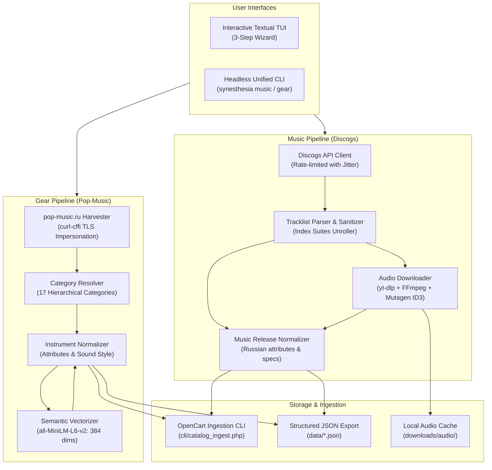

# Synesthesia Parser 🎵🎸

[](https://github.com/your-username/synesthesia-parser/actions/workflows/ci.yml)
[](https://www.python.org/downloads/)
[](LICENSE)
[](https://peps.python.org/pep-0008/)

**Synesthesia Parser** is a high-performance, dual-engine scraping and ingestion pipeline designed for specialized e-commerce platforms (such as **OpenCart**).

It bridges the gap between music release archives and musical equipment catalogs by pairing **Discogs metadata harvesting** with **automated audio preview generation**, alongside a **musical gear scraper** equipped with **384-dimensional semantic text embeddings** for vector search.

---

## Architecture Overview



---

## Key Features

### 🎵 1. Discogs Music Harvester
- **Physical Formats**: Specialized extraction for **Vinyl** (`LP`, `2xLP`, `Gatefold`, `7"`, `12"`) and **CD** (`Album`, `Maxi-Single`).
- **Release Classification**: Intelligent categorization into `album`, `live`, `single`, and `ep`.
- **Concert & Live Filtering**: Multi-lingual detection (`live`, `in concert`, `unplugged`, `концерт`, `вживую`) with support for custom keyword overrides.
- **Strict Content Sanitization**: Strips repetitive English promotional/Wikipedia intros and formats factual Russian HTML product descriptions with artist, year, label, and format details.
- **Tracklist Unpacking**: Resolves composite multi-part suites, disc sides (`Side A`, `Side 1`), track positions, and durations.
- **Automated Audio Previews**: Discovers track audio using `yt-dlp`, converts files via `FFmpeg` with selectable bitrates (`128`, `192`, `256`, `320` kbps), injects ID3v2 tags via `mutagen`, and links preview paths directly into the payload.
- **Rate-Limiting & Jitter**: Built-in `DiscogsRateLimiter` managing token-authenticated limits (60 req/min) with adaptive backoff on HTTP 429.

### 🎸 2. Pop-Music Gear Scraper
- **Anti-Bot Bypass**: Leverages `curl-cffi` with Chrome/Safari TLS fingerprint impersonation to bypass Cloudflare security without browser overhead.
- **Intelligent Category Resolver**: Heuristic resolver mapping products to 17 OpenCart category paths (Guitars, Keyboards, Bowed Strings, Guitar Amps & FX, etc.) with unmapped product logging (`unmapped_products.log`).
- **Semantic Vector Embeddings**: Generates 384-dimensional dense vector embeddings using `sentence-transformers` (`all-MiniLM-L6-v2`) from normalized equipment specs and sound-style prompts.

### 🖥️ 3. Interactive Terminal UI (TUI)
- Built with [Textual](https://textual.textualize.io/) featuring a guided 3-step workflow:
  1. **Step 1: Configuration**: Toggle between Music and Gear modes, set artist/URL, formats, release types, quantities, audio settings, and API tokens.
  2. **Step 2: Progress & Monitoring**: Real-time console logs and progress indicators.
  3. **Step 3: Data Inspection**: Interactive DataTable to inspect scraped items, attributes, and payloads before persistence.
- Convenient navigation shortcuts: `Esc` or `1` to instantly return to setup.

### ⚡ 4. OpenCart Ingestion Pipeline
- Stream payloads directly to OpenCart's custom CLI handler (`cli/catalog_ingest.php`) via `--pipe-to-oc` or `--ingest`.
- Includes `--dry-run` flag for verifying data models and category mapping without persisting database changes.

---

## Prerequisites

- **Python**: `3.13` or higher
- **Package Manager**: [uv](https://github.com/astral-sh/uv) (recommended) or standard `pip`
- **FFmpeg**: Required for audio transcoding (MP3 extraction) in the music pipeline.

### Installing FFmpeg

- **Windows**:
  ```powershell
  winget install Gyan.FFmpeg
  # or
  choco install ffmpeg
  ```
- **macOS**:
  ```bash
  brew install ffmpeg
  ```
- **Ubuntu/Debian**:
  ```bash
  sudo apt-get update && sudo apt-get install -y ffmpeg
  ```

---

## Installation

### Using `uv` (Recommended)

```bash
# Clone the repository
git clone https://github.com/your-username/synesthesia-parser.git
cd synesthesia-parser

# Install dependencies and create virtual environment
uv sync
```

### Using standard `venv` & `pip`

```bash
python -m venv .venv
# On Windows:
.venv\Scripts\activate
# On Linux/macOS:
source .venv/bin/activate

pip install -e .
```

---

## Configuration

Copy `.env.example` to `.env`:

```bash
cp .env.example .env
```

Open `.env` and configure your settings:

```dotenv
# Discogs API Personal Access Token (60 requests/minute)
# Generate a free token at: https://www.discogs.com/settings/developers
DISCOGS_TOKEN=your_token_here
```

> **Note**: While basic Discogs requests work without authorization (limited to 25 req/min), an API token is strongly recommended to access search endpoints and higher rate limits (60 req/min).

---

## Usage Guide

### 1. Interactive Terminal UI (TUI)

Launch the interactive interface without arguments:

```bash
uv run python main.py
```

Navigate through the tabs to configure your scrape, toggle audio downloads, review live logs, and browse extracted products in the table.

---

### 2. Music Mode CLI (`synesthesia music`)

Scrape Vinyl or CD releases from Discogs with optional tracklist audio downloads:

```bash
# Basic search: 5 studio vinyl albums by Pink Floyd
uv run python main.py music --artist "Pink Floyd" --format vinyl --type album --limit 5

# Search specific releases on CD with 320 kbps audio previews
uv run python main.py music \
  --artist "Daft Punk" \
  --format cd \
  --release "Discovery, Homework" \
  --download-audio \
  --audio-tracks all \
  --audio-quality 320 \
  --output data/daft_punk.json

# Scrape live concert recordings on vinyl and stream directly to OpenCart
uv run python main.py music \
  --artist "Led Zeppelin" \
  --format vinyl \
  --live \
  --limit 3 \
  --pipe-to-oc

# Dry run with custom stock quantity
uv run python main.py music -a "David Bowie" -f vinyl -q 10 --limit 5
```

#### CLI Options: `music`

| Flag | Short | Default | Description |
|---|---|---|---|
| `--artist` | `-a` | *Required* | Artist name to search (e.g. `'Pink Floyd'`) |
| `--format` | `-f` | `vinyl` | Physical format: `vinyl` or `cd` |
| `--type` | `-t` | `all` | Release type filter: `all`, `album`, `live`, `single`, `ep` |
| `--live` | | `False` | Filter specifically for concert/live recordings |
| `--live-keywords` | | *Preset* | Comma-separated live keywords (e.g. `'live, concert, unplugged'`) |
| `--release` | `-r` | `""` | Comma-separated release titles to filter |
| `--quantity` | `-q` | `5` | Stock quantity assigned in OpenCart |
| `--limit` | `-l` | `5` | Maximum number of releases to scrape |
| `--download-audio`| | `False` | Download MP3 track previews via `yt-dlp` |
| `--audio-tracks` | | `all` | Tracks per release to download: `all`, `1` (preview), `3`, `5` |
| `--audio-quality`| | `192` | MP3 audio bitrate: `128`, `192`, `256`, `320` kbps |
| `--output` | `-o` | `None` | Path to export generated JSON payload |
| `--pipe-to-oc` | | `False` | Stream JSON directly to OpenCart `catalog_ingest.php` CLI |
| `--discogs-token`| | `None` | Personal Access Token (or uses `DISCOGS_TOKEN` from `.env`) |
| `--interactive` | `-i` | `False` | Force interactive terminal wizard |

---

### 3. Gear Mode CLI (`synesthesia gear`)

Scrape musical instruments and equipment from `pop-music.ru`:

```bash
# Scrape 10 synthesizers with 384-dimensional MiniLM embeddings
uv run python main.py gear \
  --url "https://pop-music.ru/catalog/klavishnyie/sintezatoryi/" \
  --limit 10 \
  --output data/synthesizers.json

# Scrape without vector embeddings (faster)
uv run python main.py gear --url "https://pop-music.ru/catalog/gitaryi/elektrogitaryi/" --limit 5 --no-vectorize

# Scrape and test ingestion with --dry-run
uv run python main.py gear --limit 5 --ingest --dry-run
```

#### CLI Options: `gear`

| Flag | Short | Default | Description |
|---|---|---|---|
| `--url` | `-u` | *Default URL* | Target catalog URL on `pop-music.ru` |
| `--limit` | `-l` | `5` | Maximum number of products to scrape |
| `--no-vectorize`| | `False` | Disable MiniLM 384-dimensional vector embedding generation |
| `--ingest` | | `False` | Pipe scraped products into OpenCart CLI (`catalog_ingest.php`) |
| `--dry-run` | | `False` | Simulate OpenCart ingestion without persisting database records |
| `--output` | `-o` | `None` | Path to export generated JSON payload |
| `--min-jitter` | | `0.5` | Minimum delay between HTTP requests (seconds) |
| `--max-jitter` | | `1.5` | Maximum delay between HTTP requests (seconds) |

---

## Data Model Contract

Both pipelines produce standardized payloads matching the OpenCart `catalog_ingest.php` ingestion schema:

### Music Release Schema (`type: "track"`)

```json
{
  "type": "track",
  "name": "The Dark Side of the Moon",
  "model": "DISCOGS-VINYL-1873013",
  "price": 29.99,
  "quantity": 5,
  "category_ids": [2, 1],
  "image_url": "https://i.discogs.com/.../primary.jpg",
  "additional_images": ["https://i.discogs.com/.../back.jpg"],
  "description": "<p><strong>Исполнитель:</strong> Pink Floyd<br><strong>Альбом:</strong> The Dark Side of the Moon (1973)<br><strong>Лейбл:</strong> Harvest</p>",
  "attributes": {
    "Исполнитель": "Pink Floyd",
    "Жанр": "Rock",
    "Год выпуска": "1973",
    "Лейбл": "Harvest",
    "Формат издания": "Виниловая пластинка",
    "Вайб / Характер звучания": "Psychedelic Rock, Prog Rock"
  },
  "tracklist": [
    {
      "track_num": 1,
      "title": "Speak to Me",
      "duration": "1:08",
      "preview_file": "downloads/audio/pink_floyd/the_dark_side_of_the_moon/01_speak_to_me.mp3",
      "status": 1,
      "sort_order": 0
    }
  ]
}
```

---

## Running Tests

The test suite includes comprehensive coverage for tracklist parsing, Discogs rate-limiting, audio downloader slugification, category heuristics, and TUI lifecycle:

```bash
# Run all unit tests
uv run python -m unittest discover -s tests -p "test_*.py"

# Or using pytest (if installed)
uv run pytest
```

---

## Project Structure

```text
synesthesia-parser/
├── .github/
│   ├── ISSUE_TEMPLATE/
│   │   ├── bug_report.md
│   │   └── feature_request.md
│   └── workflows/
│       └── ci.yml                 # Automated testing on Ubuntu & Windows
├── scraper/
│   ├── app.py                     # Textual TUI Application
│   ├── audio_downloader.py        # yt-dlp & FFmpeg audio pipeline
│   ├── category_resolver.py       # OpenCart category heuristics (17 categories)
│   ├── cli.py                     # Unified CLI argument parser & execution
│   ├── discogs_client.py          # Discogs API client with rate-limiting & jitter
│   ├── encoder.py                 # MiniLM semantic vectorization (384d)
│   ├── engine.py                  # Scraping engine dispatcher
│   ├── gear_engine.py             # Pop-Music equipment scraper (curl-cffi)
│   ├── importer.py                # OpenCart catalog_ingest.php CLI bridge
│   ├── models.py                  # Pydantic data schemas
│   ├── music_discogs.py           # Re-exports & compatibility layer
│   ├── normalizer.py              # Music & gear attributes normalizer
│   └── tracklist_parser.py        # Tracklist & description parser
├── tests/
│   ├── test_app.py                # TUI mount & navigation tests
│   ├── test_category_resolver.py  # Category heuristics & unmapped tests
│   ├── test_core.py               # Core normalizer, encoder & payload tests
│   └── test_music_pipeline.py     # Discogs harvester, audio & CLI tests
├── .env.example                   # Environment configuration template
├── .gitignore                     # Git ignore rules
├── CONTRIBUTING.md                # Contribution guidelines
├── LICENSE                        # MIT License
├── main.py                        # Top-level entrypoint
├── pyproject.toml                 # Package definition & dependencies
└── uv.lock                        # Deterministic dependency lockfile
```

---

## Contributing

Contributions are welcome! Please read [CONTRIBUTING.md](CONTRIBUTING.md) for details on code style, running tests, and submitting pull requests.

---

## License

This project is licensed under the MIT License - see the [LICENSE](LICENSE) file for details.
